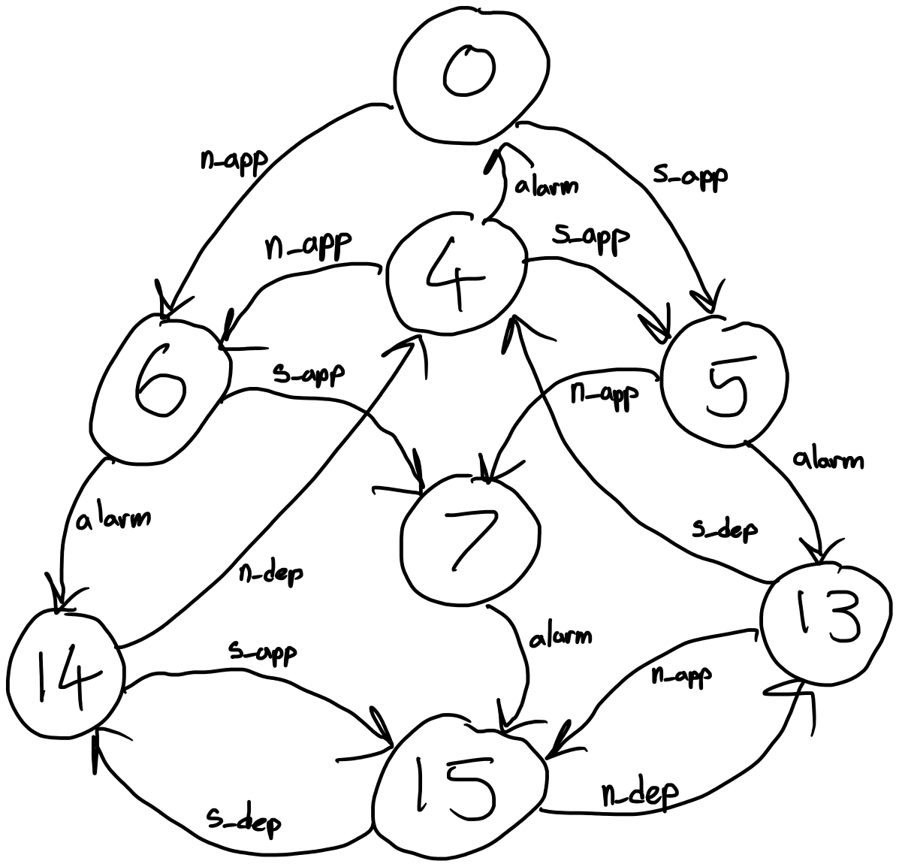

# Updated Table FSM

# Explain DIfferences in FSM's
- Increased the number of states from 4 total states to 8 total states
  - old we were just looking at just if the train was present. New one looks arm being up/down and alarm being on/off as well as train being present
- Only 8 states since 8 states are considered safety hazards based on our specifications and invariants
  
